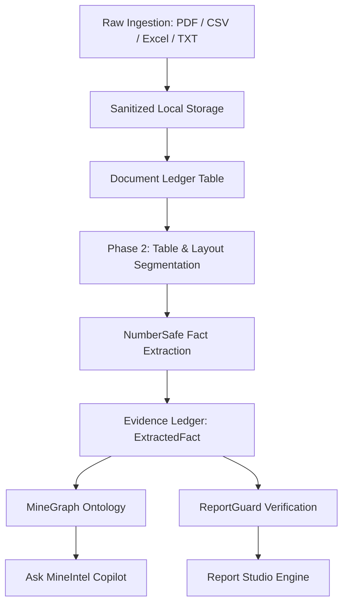

# MineIntel — Technical Architecture Document (Phase 1)

## 1. System Vision & Core Concepts

MineIntel is engineered to transform raw unstructured and semi-structured geological reports, production records, and dispatch sheets into an audit-ready, queryable, and verifiable intelligence repository for CMPDI and Coal India Limited.

---

## 2. Four Branded Core Concepts

### I. MineGraph
The cross-document knowledge graph linking physical entities, operational hierarchies, and chronological data points:
- **Hierarchical Path**: `Mine (e.g. Rajmahal OCP) ➔ Coalfield (Raniganj) ➔ Subsidiary (ECL) ➔ Parent Company (CIL)`.
- **Temporal & Metric Path**: `Metric Code (COAL_PROD_RAW) ➔ Value (1.85 MT) ➔ Reporting Period (November 2024)`.
- **Provenance Link**: `➔ Document (sample_production.csv) ➔ Cell Reference (Row 2, Col 5)`.

### II. NumberSafe AI
Generative models often invent plausible-sounding numerical values when asked to summarize or answer questions across tables. NumberSafe AI guarantees that:
- Numerical facts are extracted via deterministic code (parsers, regex, tabular cell extraction).
- Calculations (sums, averages, variances) are executed in SQL or Python.
- LLMs are restricted to narrative synthesis, classification assistance, and linguistic structuring.

### III. EvidenceChain
Every single quantitative assertion or chart in MineIntel is traceable to:
`Source Document ➔ Page / Sheet ➔ Row / Column / Cell ➔ Extracted Fact Record ➔ Validation Status ➔ Visual Output`.

### IV. ReportGuard
A multi-checkpoint validation suite to be fully realized in Phase 7:
- Flags missing citations.
- Detects discrepancies between subsidiary reports and consolidated statements.
- Prevents unverified or conflicting figures from entering parliamentary briefs.

---

## 3. Database Schema Overview (Phase 1)

1. **`documents`**: Tracks file metadata, storage location, processing lifecycle (`UPLOADED`, `CLASSIFYING`, `EXTRACTING`, `READY`), and statistics.
2. **`document_chunks`**: Segmented text sections with page numbers for downstream RAG and semantic search.
3. **`extracted_facts`**: Core Evidence Ledger storing granular metric values, units, subsidiary tags, and exact cell/row/page coordinates.
4. **`validation_issues`**: Audit records of issues detected by automated rules (e.g. missing units, out-of-range figures).
5. **`evidence_conflicts`**: Contradictions detected across multiple documents covering the same entity and timeframe.
6. **`review_actions`**: Human-in-the-loop analyst decisions (approvals, edits, rejections).
7. **`generated_reports`**: Output briefs and summaries created in Report Studio.
8. **`topics` & `topic_mentions`**: Semantic clustering tags and occurrences.
9. **`query_history`**: Traceable log of queries submitted to Ask MineIntel.
10. **`audit_events`**: Immutable chronological security and action ledger.
11. **`system_settings`**: Key-value platform overrides.
12. **`users`**: Analyst identity and role mapping.
